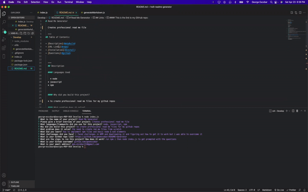

# Read Me Generator

  To create professional Read Me files to my Github repos

  ---
## Table of Contents:

- [Description](#description)
- [Links](#links)
- [Installation](#installation)
- [Questions](#questions)

  ---
  ## Description

  #### Languages Used
  
  	* node
	* javascript
	* npm

  
  #### Why did you build this project?
  
  * To create a more efficient way to make read me files. 
  
  #### What problem does it solve?
  
  * Solves the need to build read me files from scratch.
  
  #### What challenges did you face?
  
  * How to actually download the inquirer package and few minor details on the read me format
  
  #### What did you learn?
  
  * How to use NPMJS and implement it onto  my own projecs
  
  ---
  ## Links 
  
  #### This is the link to my GitHub repo:
  * [Github Repo](https://github.com/geoescobar/README-Generator)

   
  ---

  ## Installation
  * Download npm i then run node index.js which will prompt the questions

  ---
  ## Questions 

  #### If you have questions regarding this repository? Below is my contact info:

  * github.com/geoescobar
  * geo.escobar214@gmail.com

